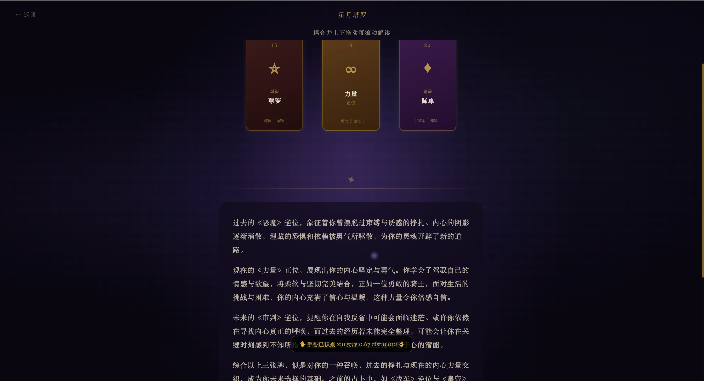
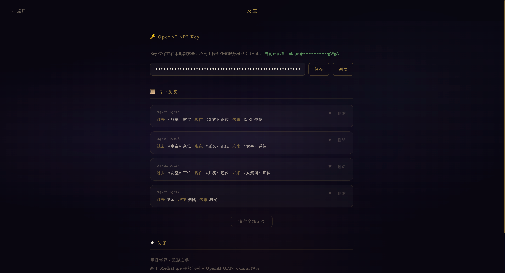

# 星月塔罗 · 无形之手

> 以无形之手，触碰命运的低语

一款基于**手势识别**的沉浸式塔罗牌占卜 Web 应用。通过 MediaPipe 实时捕捉手部动作，以「空中画圆」「手掌旋转」「握拳选牌」等隐形手势完成整个占卜仪式。占卜结束后由 **OpenAI GPT-4o-mini** 结合历史记录生成个性化解读，并持久化存储至 **Supabase (PostgreSQL)** 云数据库。

> 📸 Demo 截图见下方 &nbsp;·&nbsp; 需要摄像头权限 &nbsp;·&nbsp; 推荐 Chrome 浏览器

---

## ✨ 核心交互设计

| 阶段 | 手势 | 效果 |
|------|------|------|
| 唤醒法阵 | 食指在空中画圆 | 法阵图像随画圆进度逐步发光点亮，完成后爆闪进入下一阶段 |
| 旋转命运之轮 | 左右移动手掌 | 法阵与卡牌跟随手势实时旋转 |
| 进入选牌 | 捏合并保持 | 进度条填满后进入选牌阶段 |
| 悬停高亮 | 手掌对准牌面停留 | 牌面发光高亮 |
| 选中牌 | **握拳保持 3 秒** | 进度条填满后选中当前高亮牌 |
| 阅读解读 | 捏合上下拖动 | 滚动 AI 解读文本 |

> 所有手势操作均可通过**点击**完成，摄像头为可选增强体验。

### ⚙️ 设置页

点击首页右上角 **齿轮图标 ⚙** 进入设置页，可以：
- 填写并保存 **OpenAI API Key**（Key 仅存储在本地浏览器，不会上传至任何服务器）
- 测试 API Key 连接是否正常
- 查看**历史占卜记录**（时间、牌面、AI 解读），支持展开/折叠、单条删除、清空全部

> 未填写 API Key 时，系统自动降级为本地模板解读，功能仍可完整使用。

---

## 📸 Demo 截图

| 首页法阵 | 旋转选牌 | 选牌 | AI 解读 | 设置与历史 |
|---------|---------|------|---------|---------|
|  |  |  |  |  |

> 截图展示手势识别实时追踪、法阵发光效果、AI 个性化解读与历史记录页面。

---

## 🏗 技术架构

```
tarot-gesture/
├── src/                          # 前端 (React + TypeScript + Vite)
│   ├── components/
│   │   ├── HomePage.tsx          # 首页，法阵旋转动画 + 齿轮入口
│   │   ├── ReadingPage.tsx       # 主占卜页面，五阶段状态机
│   │   ├── SettingsPage.tsx      # 设置页：API Key + 历史记录
│   │   ├── TarotCard.tsx         # 塔罗牌，含翻转动画
│   │   ├── SpreadLayout.tsx      # 三牌阵布局
│   │   ├── ResultPanel.tsx       # AI 解读结果面板
│   │   └── GestureIndicator.tsx  # 手势状态实时 HUD
│   ├── hooks/
│   │   ├── useHandTracking.ts    # MediaPipe 手势识别 Hook
│   │   └── useTarotReading.ts    # 占卜流程状态机
│   ├── lib/
│   │   ├── circleGesture.ts      # 画圆手势轨迹分析算法
│   │   └── tarotEngine.ts        # 抽牌引擎与本地解读（降级用）
│   └── data/tarotData.ts         # 22 张大阿尔卡那完整数据
└── server/                       # 后端 (Express + Node.js)
    ├── index.ts                  # Express 入口
    ├── db.ts                     # Supabase 客户端初始化
    └── routes/
        ├── reading.ts            # POST /api/reading → 调 OpenAI → 存库
        └── history.ts            # GET/DELETE /api/history
```

### 关键技术点

- **画圈识别**：基于手部轨迹的几何分析，计算圆形度、封闭性、旋转角等多维特征分数，动态点亮法阵进度
- **握拳检测**：比较指尖与第一关节到手腕的相对距离，握拳时指尖更靠近手腕，4 根手指满足则触发
- **RAF + Ref 模式**：requestAnimationFrame 循环通过 ref 读取最新手势坐标，避免 React 闭包陈旧值问题
- **五阶段状态机**：`intro → preview → selecting → revealing → reading`，每阶段独立手势逻辑
- **AI 上下文解读**：将最近 3 次历史占卜记录注入 prompt，生成有记忆的个性化解读
- **双重降级**：无 API Key → 本地模板解读；服务器离线 → 仍可完整占卜（无历史记录）

---

## 🚀 本地运行

### 前置要求

- Node.js 18+（推荐 LTS 版本，v25 有原生模块兼容问题）
- Chrome 浏览器（MediaPipe 在 Chrome 上支持最佳）
- Supabase 账号（免费）
- OpenAI API Key（可选，无 Key 时降级为本地解读）

### 1. 克隆并安装依赖

```bash
git clone https://github.com/你的用户名/tarot-gesture.git
cd tarot-gesture
npm install
```

### 2. 配置环境变量

```bash
cp .env.example .env
```

编辑 `.env`：

```env
# Supabase 配置（Project Settings → API Keys）
SUPABASE_URL=https://你的项目ID.supabase.co
SUPABASE_ANON_KEY=eyJ...你的anon_public_key
SUPABASE_SERVICE_KEY=sb_secret_...你的secret_key
```

### 3. 初始化数据库

在 Supabase SQL Editor 运行：

```sql
CREATE TABLE readings (
  id         BIGSERIAL PRIMARY KEY,
  created_at TIMESTAMPTZ DEFAULT NOW(),
  card_past    TEXT NOT NULL,
  card_present TEXT NOT NULL,
  card_future  TEXT NOT NULL,
  ai_reading   TEXT NOT NULL
);
```

在 **Integrations → Data API → Settings → Exposed tables** 里勾选 `readings`。

### 4. 启动

```bash
npm run dev:all
```

- 前端：http://localhost:5173
- 后端：http://localhost:3001

### 5. 配置 OpenAI API Key

打开应用 → 右上角齿轮 ⚙ → 填入 OpenAI API Key → 保存

Key 仅存储在本地浏览器，不会上传至任何服务器。

---

## ⚙️ 可用脚本

| 命令 | 说明 |
|------|------|
| `npm run dev` | 仅启动前端 |
| `npm run dev:server` | 仅启动后端 |
| `npm run dev:all` | 同时启动前后端 |
| `npm run build` | 构建生产版本 |

---

## 📋 浏览器兼容

| 浏览器 | 支持 |
|--------|------|
| Chrome 90+ | ✅ 推荐 |
| Edge 90+ | ✅ 良好 |
| Firefox 88+ | ⚠️ 可用 |
| Safari 15+ | ⚠️ 需手动允许摄像头，手势识别有限 |

---

## 🃏 牌库

包含完整 22 张大阿尔卡那，含正逆位判断、关键词、详细中文解读。

---

## 📁 环境变量说明

| 变量 | 必填 | 说明 |
|------|------|------|
| `SUPABASE_URL` | ✅ | Supabase 项目 URL |
| `SUPABASE_ANON_KEY` | ✅ | Supabase anon public key，用于读取历史 |
| `SUPABASE_SERVICE_KEY` | ✅ | Supabase secret key，用于写入数据 |

OpenAI API Key 在前端设置页配置，不需要放在 `.env` 中。

---
